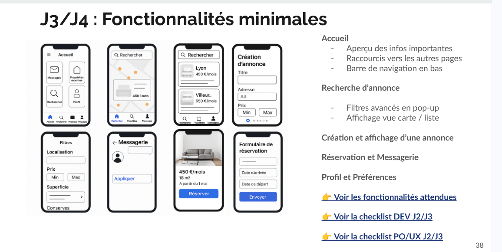

# Projet ART

Des groupes se forment sur la base de leur discipline artistique (musique, danse, théâtre, art…)
Un organisateur (amateur, artiste, professionnel…) détermine le lieu, le contenu, la fréquence de la session et les frais d’organisation
Les intéressés peuvent s’inscrire par session
Le premier contact a lieu par messagerie entre intéressés
Des annonceurs font la publicité pour des événements, des équipements…

Attendus
Application
Inscription
Recherche d’une annonce
Création / Édition d'une annonce
Messagerie / Réservation
Accueil / État de disponibilité
Carte et géolocalisation
Profil d’utilisateur et préférences
Annonce / Réservation
Vérification / signature (Front)
Site vitrine
👉 Voir les fonctionnalités minimales

