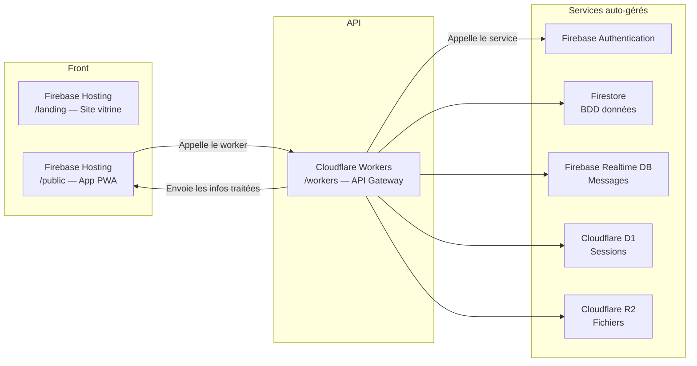

# Stack technique — Architecture serverless

## Composants

| Couche | Techno | Rôle |
|--------|--------|------|
| Front End | PWA (Shadcn / Shadcn-Vue / Spartan) | Interface mobile-first |
| Carte | LeafletJS | Affichage géographique des annonces |
| Géolocalisation | Google Places API | Autocomplete adresse + geocoding |
| Interface REST API | Cloudflare Workers | Point d'entrée unique du backend |
| Authentification | Firebase Auth | Connexion sans mot de passe (lien magique) |
| BDD Données | Firestore (NoSQL) | Annonces, profils, réservations |
| BDD Messages | Firebase Realtime DB | Messagerie |
| BDD Sessions | Cloudflare D1 (SQL) | Sessions utilisateur |
| Fichiers | Cloudflare R2 | Photos, documents |
| Hébergement | Firebase Hosting | Site vitrine + application |

## Sécurité

- Les identifiants de service Firebase sont stockés dans les secrets du Worker, jamais commités
  ni exposés côté front.
- L'accès au Worker est restreint par nom de domaine (CORS).

## Déploiement

- Front (`/landing`, `/public`) : `firebase deploy` (ou GitHub Actions)
- Back (`/workers`) : `wrangler deploy`
